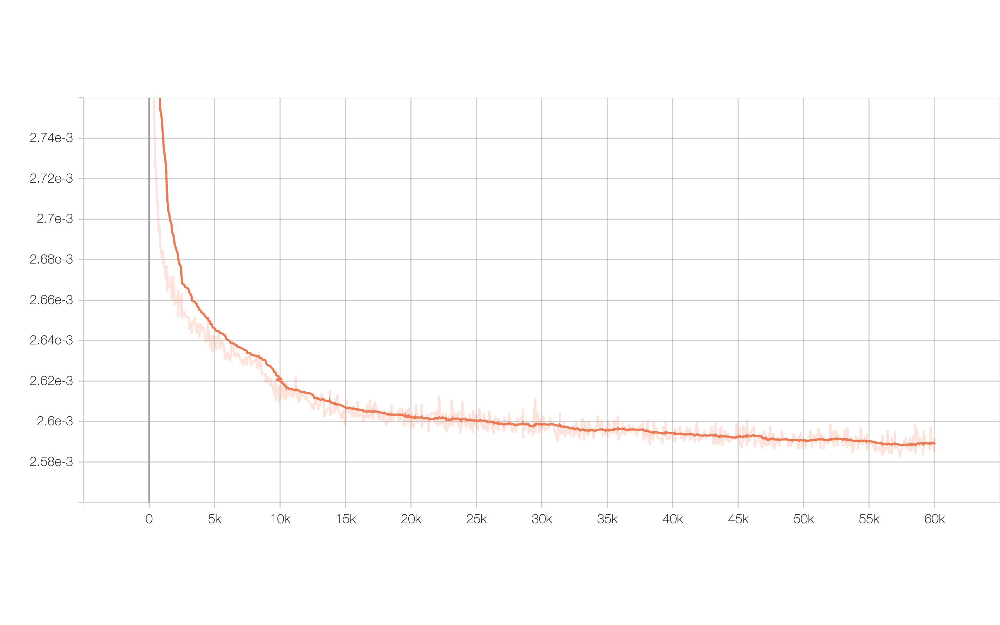
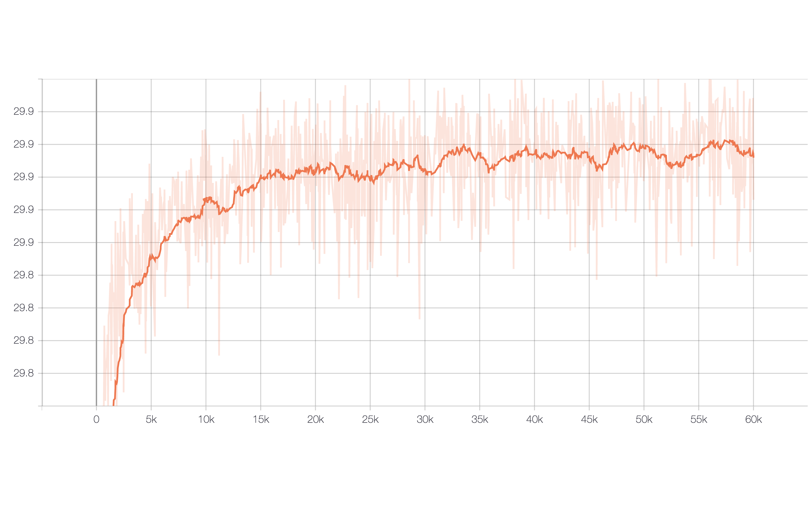
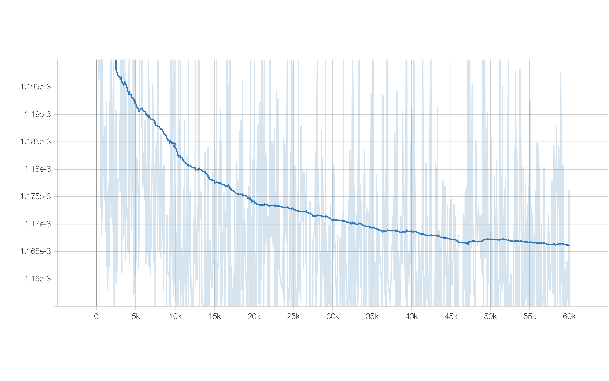
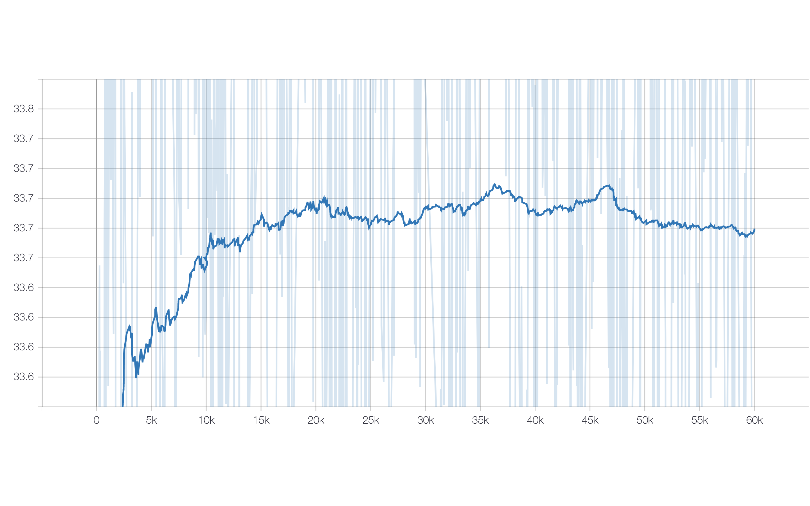
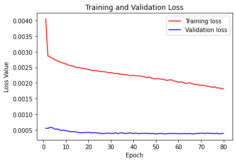
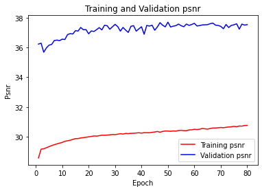

# Super Resolution in Tensorflow 2
In this repository I will implement SR papers using tensorflow 2.0

## SRCNN
I have trained the SRCNN for 60000 epochs.

You can find the trained models and training logs in this [link](https://drive.google.com/open?id=15BDCxku5RXoLUwUpvxT7f7do3lR453SG)

you can donwload the 91 dataset as well as Set5 and set14 in this [link](https://drive.google.com/open?id=1KTRWi8aIBSip0Ir7XvWjNg9eumhQan_R)

output:
*Ground truth* | *Low resolution x3* | *SRCNN output*
:---: | :---: | :---: 
 |  |  

*Train loss* | *Train psnr*
:---: | :---: 
 |  

*Valid loss* | *Valid psnr*
:---: | :---: 
 |  

## VDSR
You can find the trained models and training logs in this [link](https://drive.google.com/open?id=1VTLcCX9He7l3xnBzPjngMLjt3O39_QFm)

*Ground truth* | *Low resolution x3* | *VDSR output*
:---: | :---: | :---: 
 |  |  

*Loss* | *Psnr*
:---: | :---: 
 |  
